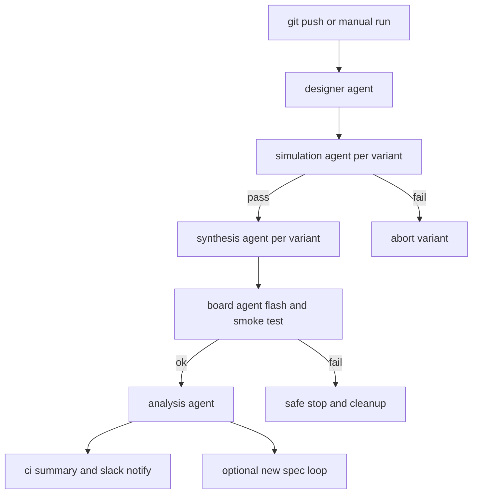

# CrewAI Orchestrated Flow Plan

Decisions baseline
- Orchestrator: CrewAI library
- Config schema: flat per common loader
- Scope v1: include hardware flashing and basic smoke test on single iCEBreaker
- Approvals: manual CI approval required for any hardware actions and Slack notifications

Objectives
- Automate designer to sim to synth to hardware to analysis
- Enforce safety gates and single board resource lock
- Provide reproducible artifacts and concise notifications

Architecture overview
- Orchestrator: new [orchestrator/crew.py](orchestrator/crew.py)
- Agents existing
  - Designer [agents/designer.py](agents/designer.py)
  - Simulation [agents/sim.py](agents/sim.py)
  - Synthesis [agents/synth.py](agents/synth.py)
  - Analysis [agents/analysis.py](agents/analysis.py)
- Agents new
  - Board [agents/board.py](agents/board.py)
  - Resource locking [common/resources.py](common/resources.py)
  - Notifications [common/notify.py](common/notify.py)

Event flow

Configuration schema standardization
- Replace nested params with flat keys in [configs/variants.yaml](configs/variants.yaml)
- Required keys per variant
  - name string
  - taps int
  - pipeline int or bool
  - round string round or truncate
  - sat string saturate or wrap
- Optional keys
  - seed int
  - yosys_opts string
  - nextpnr_opts string
  - freq int default 12
- Synthesis will map round to 1 when round else 0 and sat to 1 when saturate else 0

Changes by component
- Designer no changes if it already validates flat schema via [common/config.py](common/config.py)
- Simulation confirm flat schema usage for variant lookup already supported in [agents/sim.py](agents/sim.py)
- Synthesis refactor in [agents/synth.py](agents/synth.py)
  - Load via common config instead of reading nested params
  - Translate flat fields to Yosys and nextpnr parameters
  - Honor per variant yosys_opts nextpnr_opts seed and freq
  - Preserve artifacts at build variant and aggregate to [artifacts/variants_summary.csv](artifacts/variants_summary.csv)
- Board new in [agents/board.py](agents/board.py)
  - Responsibilities
    - Acquire exclusive lock for board
    - Flash bitstream with iceprog and verify
    - Basic smoke test can be a timed delay or simple IO probe as available
    - Enforce cooldown between flashes default 5 s
    - Fail safe cleanup and lock release on any error
- Resources new in [common/resources.py](common/resources.py)
  - File lock path [artifacts/locks/icebreaker.lock](artifacts/locks/icebreaker.lock)
  - TTL default 180 s with stale lock recovery
  - Reentrant allowance for same pid optional
- Notifications new in [common/notify.py](common/notify.py)
  - Slack webhook URL from env SLACK_WEBHOOK_URL
  - Minimal summary payload build link variant result error summaries
  - No secret is logged and failures are non fatal
- Orchestrator new in [orchestrator/crew.py](orchestrator/crew.py)
  - Define Crew agents tasks and connections
  - Gate synth on sim pass and board on sim pass plus synth success
  - Limit concurrency software tasks up to 2 hardware tasks 1
  - Timeouts and cancellation paths with cleanup

Safety and reproducibility
- No hardware unless matching simulation passed
- Optional formal step later using [formal/fir8.sby](formal/fir8.sby)
- Board guardrails current temp cooldown and retry limits
- Determinism log seeds tool versions and container tags from [Dockerfile](Dockerfile)
- Log persistence in [artifacts](artifacts/)

CI workflow changes
- Software job on push
  - Run designer then per variant simulation then per variant synthesis
  - Upload artifacts bitstreams summaries and logs
- Hardware job requires manual approval and self hosted runner with the board attached
  - Downloads artifacts
  - Runs board smoke for one selected variant default baseline8
  - Posts Slack summary
  - Archives updated report and hardware logs
- Workflow file to update [\.github/workflows/ci.yml](.github/workflows/ci.yml)

Artifacts layout
- build variant yosys json asc bin netlist v report files
- artifacts variants_summary.csv
- artifacts report_phase1.md
- artifacts hardware logs under artifacts hw variant date
- artifacts locks icebreaker.lock

Acceptance criteria v1
- Flat schema validated by [common/config.py](common/config.py) and used across agents
- Simulation pass gate enforced no board action if simulation fails
- Synthesis produces bitstream and updates [artifacts/variants_summary.csv](artifacts/variants_summary.csv)
- Hardware job manual approval enforced and successful flash verify logs produced
- Slack message posted on hardware job completion or failure
- Report includes hardware smoke status via [agents/analysis.py](agents/analysis.py) and [scripts/mk_phase1_report.py](scripts/mk_phase1_report.py)

Rollout steps
- Rewrite [configs/variants.yaml](configs/variants.yaml) to flat schema
- Implement converter at [scripts/convert_variants_schema.py](scripts/convert_variants_schema.py) to assist migration
- Refactor [agents/synth.py](agents/synth.py) to consume flat config
- Add [agents/board.py](agents/board.py) [common/resources.py](common/resources.py) [common/notify.py](common/notify.py)
- Add orchestrator at [orchestrator/crew.py](orchestrator/crew.py)
- Update [\.github/workflows/ci.yml](.github/workflows/ci.yml) with software and hardware jobs and manual approval
- Extend [scripts/mk_phase1_report.py](scripts/mk_phase1_report.py) to include hardware section
- Pilot single variant hardware run and tune cooldown and timeouts

Local runbook
- Generate validated JSON variants
  - python -m agents.designer
- Run simulation for a variant
  - python -m agents.sim --variant baseline8
- Run synthesis for a variant
  - python -m agents.synth --only baseline8
- Run analysis to regenerate report
  - python -m agents.analysis
- Run board smoke once artifact exists
  - python -m agents.board --variant baseline8 --bin build/baseline8/fir8_top.bin

Risks and mitigations
- Board contention Introduce strict file lock with TTL and clear operator guidance
- Tool nondeterminism Capture seeds and tool versions and consider containers
- CI secrets leakage Never log webhook URLs and use masked secrets
- Hardware flakiness Limit retries and enforce cooldown and safe power down

Next actions
- Approve this plan
- Switch to Code mode to implement files and workflow updates