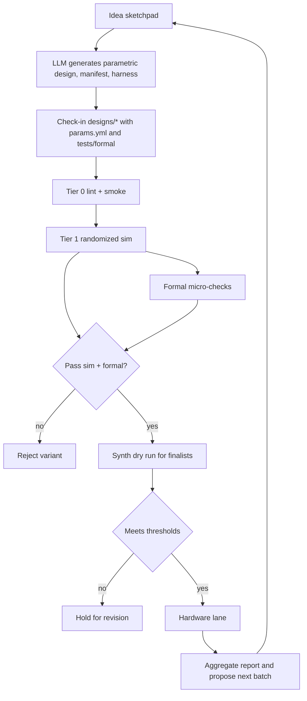

# Virtual Wind Tunnel Sketchpad

Purpose
- Add an interactive sketchpad where you and an LLM co-generate parametric design families and their tests, then run a tiered, parallel “virtual wind tunnel” across lint, simulation, and formal checks. Only finalists that repeatedly pass software gates are promoted to the scarce, expensive hardware lane.

Scope v1
- Architect and define interfaces for:
  - Sketchpad agent to generate parametric designs plus manifests and test harnesses
  - Multi-tier wind-tunnel pipeline: Tier 0 lint, Tier 1 sim, parallel formal micro-checks, and synth dry-run for finalists
  - Promotion gates and backpressure in the orchestrator
  - Results store and simple batch proposal loop (grid or greedy); BO optional in v2

Key repos and agents
- Orchestrator: [orchestrator/crew.py](orchestrator/crew.py)
- Agents: [agents/designer.py](agents/designer.py), [agents/sim.py](agents/sim.py), [agents/synth.py](agents/synth.py), [agents/analysis.py](agents/analysis.py), [agents/board.py](agents/board.py)
- Common: [common/config.py](common/config.py), [common/resources.py](common/resources.py), [common/notify.py](common/notify.py)
- Report generator: [scripts/mk_phase1_report.py](scripts/mk_phase1_report.py)

Sketchpad loop: idea → parametric design → auto-tests
- New agent: Sketchpad [agents/sketchpad.py](agents/sketchpad.py) (to be implemented)
  - Prompt-guided LLM generator emitting:
    1) Parametric design template
       - HLS C++ or RTL with explicit knobs: UNROLL, PIPELINE, BIT_WIDTH, memory partitioning
    2) Variant manifest (YAML/JSON) with legal ranges and forbidden combos
    3) Simulation contract: top I/O, clock/reset, invariants, reference hook (Python ref)
    4) Test harnesses: cocotb tests; seeds; coverage intents
    5) Formal micro-properties: SBY jobs for safety/liveness (FIFO, handshake, bounds)

- Deliverables written to a design workspace:
  - designs/<concept>/rtl or designs/<concept>/hls
  - designs/<concept>/params.yml
  - designs/<concept>/tests (cocotb) and designs/<concept>/formal (SBY)

Manifest schema (flat example)
```yaml
# designs/fir/params.yml
knobs:
  UNROLL: { type: int, values: [1,2,4,8] }
  PIPELINE: { type: int, values: [0,1] }
  BIT_WIDTH: { type: int, values: [12,16,24] }
  TAPS: { type: int, values: [4,8,16,32] }
constraints:
  forbid:
    - expr: "UNROLL > TAPS"
      reason: "Cannot unroll past kernel size"
  require:
    - expr: "BIT_WIDTH in [12,16,24]"
      reason: "Supported widths"
defaults:
  UNROLL: 1
  PIPELINE: 0
  BIT_WIDTH: 16
  TAPS: 8
simulation-contract:
  toplevel: "fir_top"
  clock: "clk"
  reset: { name: "rst", active: "high", sync: true }
  ports:
    in: [{ name: "sample_in", width: 16, signed: true, q: "Q1.15" }]
    out: [{ name: "sample_out", width: 16, signed: true, q: "Q1.15" }]
  invariants:
    - "no_x_on_outputs"
    - "latency_cycles == 1 + PIPELINE once window_full"
  reference:
    module: "ref.fir_model"
    fn: "fir_step"
```

Simulation harness requirements
- Cocotb test plan with:
  - Directed: impulse, step, ramps, extremes
  - Randomized tests with seed logging
  - Property-like checks (latency alignment, no X, range bounds)
- Reference model module callable from cocotb
- Coverage: simple counters or pytest markers for smoke vs thorough

Formal micro-checks (SBY)
- Small block or protocol properties:
  - No FIFO overflow/underflow
  - Mutual exclusion grants
  - Liveness: req eventually ack under assumptions
- Minimal SBY config, 10–60s targets for fast triage

Virtual wind-tunnel tiers
- Tier 0 (seconds)
  - RTL/HLS build lint: verilator --lint-only, iverilog parse, yosys -q read_verilog
  - “Smoke” cocotb subset (few cycles)
- Tier 1 (minutes)
  - Randomized cocotb with multiple seeds
  - Golden model comparisons
  - Waveforms only on failure (to save space)
- Formal (parallel with Tier 1)
  - SymbiYosys micro-checks across critical leaf modules
- Tier 2 (optional, finalists)
  - Deeper sims (gate-level or vendor where available)
- Synth dry run (finalists only)
  - Yosys + nextpnr metrics (LUT/FF/BRAM/DSP/Fmax/slack)
  - Vendor batch Tcl optional in v2

Promotion policy
- Promote to hardware only after:
  - Tier 0 and Tier 1 sim passes repeatedly (multiple seeds)
  - Formal essentials pass
  - Synth dry-run meets thresholds (e.g., Fmax ≥ target, utilization under cap)
- Backpressure and quotas:
  - Limit inflight synth jobs and board queue depth
  - Prefer variants near Pareto front by Analysis agent

Orchestrator changes (pools, queues, backpressure)
- Extend [orchestrator/crew.py](orchestrator/crew.py) to add worker pools:
  - sim_pool (N=CPU cores or runner capacity)
  - formal_pool (N small)
  - synth_pool (N small; license-aware)
  - board_pool (N=1; guarded by file lock [common/resources.py](common/resources.py))
- Central job queue and results DB:
  - inputs: designs/<concept>/params.yml plus chosen knob sets
  - outputs: results.csv with columns:
    - knobs..., sim_pass, formal_pass, fmax_MHz, lut, dsp, bram, power_mW?, latency_cycles
- Backpressure rules:
  - Max synth backlog K vs board capacity
  - Only enqueue synth for variants with stable sim/formal pass
- Notifications:
  - Slack summaries via [common/notify.py](common/notify.py) on batch completion or failures

Search and proposal loop
- v1: grid or greedy expansion near best candidates
- v2: Bayesian Optimization (e.g., scikit-optimize or Ax)
  - Objective: minimize energy-delay or maximize performance under constraints
  - Stopping: met targets, no improvement over N batches, or budget/time cap
- Implement as part of [agents/analysis.py](agents/analysis.py), reading and writing batch proposals (batch.json)

Wind-tunnel CI
- Add jobs for Tier 0 and Tier 1 + formal (matrix-enabled)
- Artifact retention:
  - logs, coverage, failing waveforms
  - results.csv appended per run
- Synthesis dry-run as a follow-up job (finalists only)
- Hardware smoke job remains manual approval gated

Mermaid: end-to-end flow


Initial CLI sketches
- Sketchpad agent
  - python -m agents.sketchpad --concept fir --style rtl --knobs UNROLL=1,2,4,8 PIPELINE=0,1 BIT_WIDTH=12,16,24
  - Writes designs/fir with params.yml, rtl/, tests/, formal/
- Wind-tunnel batch
  - python -m orchestrator.crew --variants-from designs/fir/params.yml --max-sim 8 --max-synth 2
  - Optional: --only-tier0, --only-tier1, --with-formal

v1 implementation tasks
- Agent and schema
  - New: [agents/sketchpad.py](agents/sketchpad.py) to call LLM and produce:
    - Parametric code template (HLS/RTL)
    - designs/<concept>/params.yml
    - Cocotb tests and SBY files
  - Define manifest schema JSONSchema for params.yml validation
- Pipeline
  - New: scripts/tier0_smoke.sh and scripts/tier1_random.sh wrappers
  - New: formal runner scripts/formal_run.sh for SymbiYosys micro-checks
  - Extend [scripts/mk_phase1_report.py](scripts/mk_phase1_report.py) to summarize wind-tunnel results.csv
- Orchestrator
  - Add pools, queue, and backpressure in [orchestrator/crew.py](orchestrator/crew.py)
  - Job model and results CSV/JSON (append-only)
- Analysis/search
  - Extend [agents/analysis.py](agents/analysis.py) to:
    - Aggregate multi-tier outcomes into results.csv
    - Propose next batch (grid or greedy)
    - v2: integrate BO library and objective definition
- CI
  - Add wind-tunnel jobs with parallel matrix for Tier 0/1 and formal
  - Collect failing waveforms; gate synth dry-run on repeated sim/formal pass
- Hardware promotion
  - Reuse [agents/board.py](agents/board.py) with stricter policy check

Security and safety
- No hardware before stable sim/formal pass and thresholded dry-run
- Determinism: log seeds, tool versions, container tags
- Sandboxing LLM-generated code: lint and static checks; do not execute arbitrary host commands

Acceptance criteria (v1)
- Sketchpad produces a parametric design folder with params.yml, cocotb tests, and SBY files
- Tier 0 and Tier 1 pipelines run headless and report pass/fail with artifacts
- Formal micro-checks run and fail fast on violations
- Orchestrator enforces promotion gates and backpressure
- Report includes wind-tunnel outcomes and finalists, alongside existing summary and hardware sections

References
- Existing orchestration: [orchestrator/crew.py](orchestrator/crew.py)
- Agents: [agents/sim.py](agents/sim.py), [agents/synth.py](agents/synth.py), [agents/analysis.py](agents/analysis.py), [agents/board.py](agents/board.py)
- Common: [common/resources.py](common/resources.py), [common/notify.py](common/notify.py)